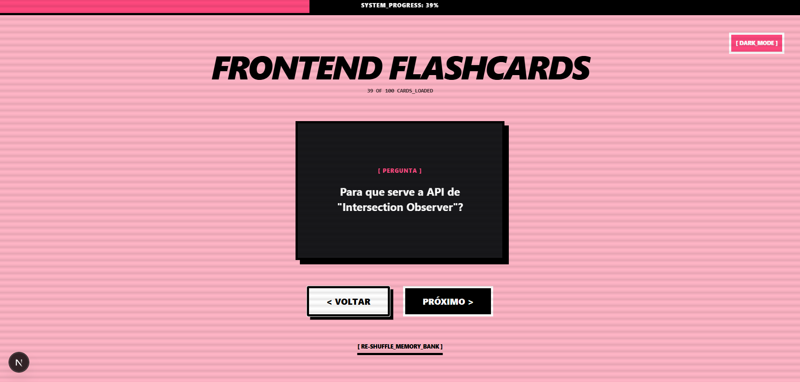
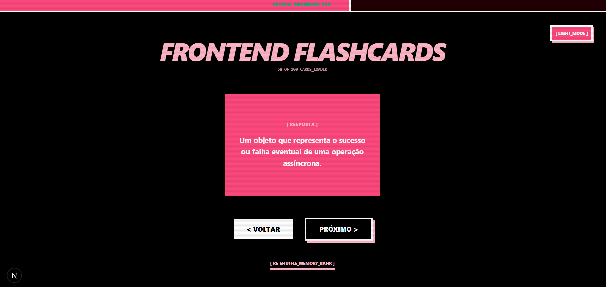

# FRONTEND FLASHCARDS

| Light Mode | Dark Mode |
| :---: | :---: |
|  |  |

> Uma aplicação de estudo interativa para desenvolvedores frontend, construída com estética **pixel art** e **brutalista** — simulando interfaces de terminais antigos e monitores CRT.

---

## ✦ Funcionalidades

- **Sistema de Flashcards** — Perguntas e respostas sobre HTML, CSS, JavaScript, React e Next.js
- **Persistência Local** — Progresso salvo automaticamente via `localStorage`
- **Modo Escuro** — Interface adaptável com suporte a Dark Mode e Light Mode
- **Efeitos Visuais CRT** — Scanlines animadas e efeito de flicker para simular monitores antigos
- **Filtros por Dificuldade** — Cards organizados em níveis **Iniciante**, **Intermediário** e **Sênior**

---

## ✦ Tecnologias

| Camada | Tecnologia |
|---|---|
| Framework | Next.js 16 (App Router) |
| Estilização | Tailwind CSS v4 |
| Linguagem | TypeScript |
| Compilação | Turbopack |

---

## ✦ Estrutura do Projeto

```
src/
├── app/          # Rotas e lógica principal da aplicação
├── components/   # Componentes reutilizáveis (Card, seletor de tema...)
├── lib/          # Funções utilitárias e formatadores isolados
└── types/        # Interfaces TypeScript para segurança de tipos
```

---

## ✦ Como Executar

**1. Instale as dependências:**

```bash
npm install
```

**2. Inicie o servidor de desenvolvimento:**

```bash
npm run dev
```

**3. Acesse a aplicação:**

```
http://localhost:3000
```

---

## ✦ DevOps & Boas Práticas

Este projeto faz parte de um **Roadmap de aprendizado em DevOps**, com foco em:

- **Código Limpo** — Separação clara entre lógica de negócio e interface
- **Modularização** — Pasta `lib/` para utilitários independentes e reutilizáveis
- **Versionamento** — Estrutura preparada para pipelines de CI/CD via **GitHub Actions**

---